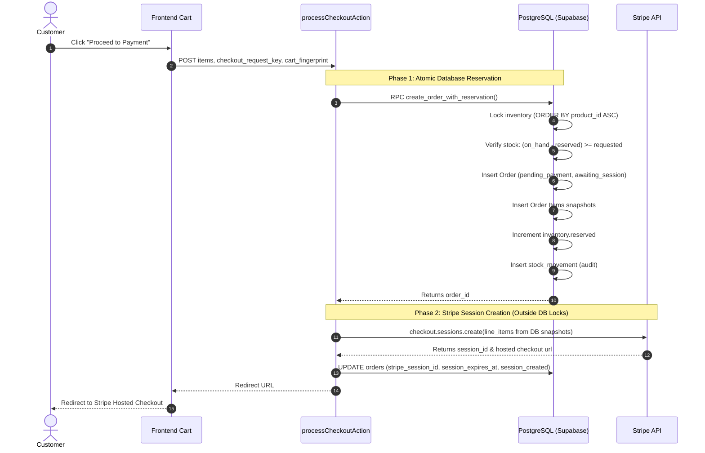
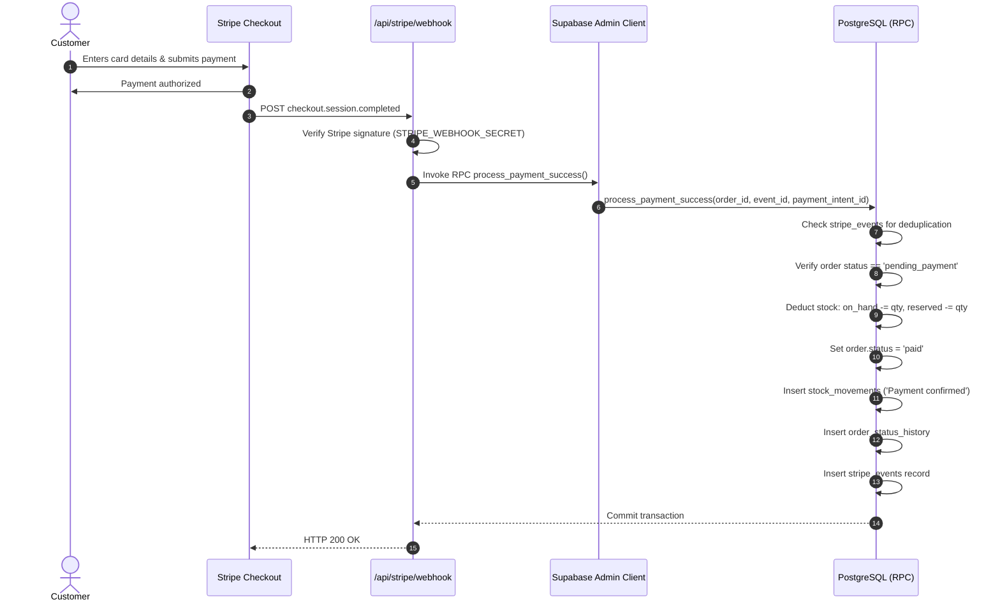
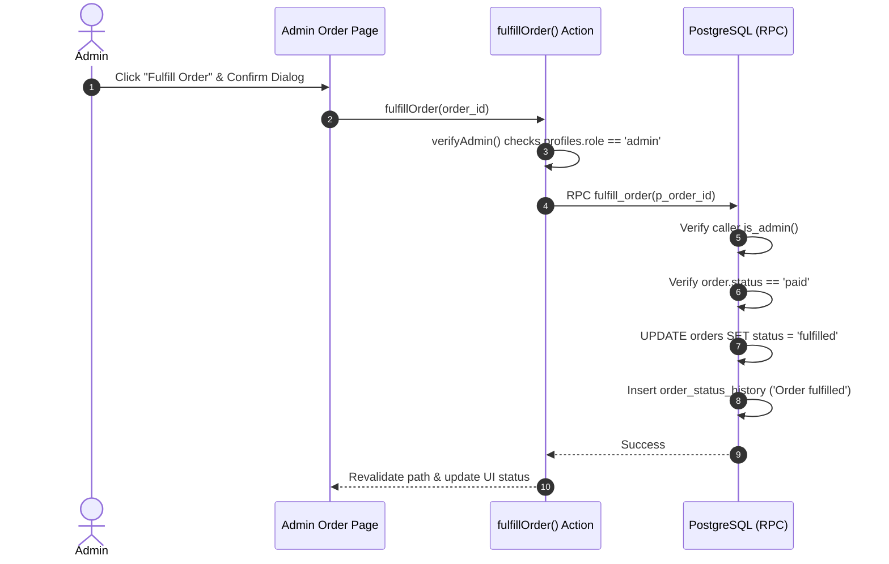
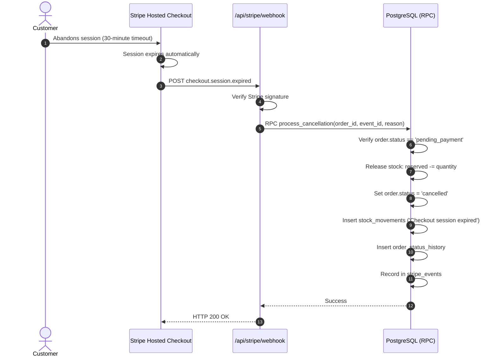
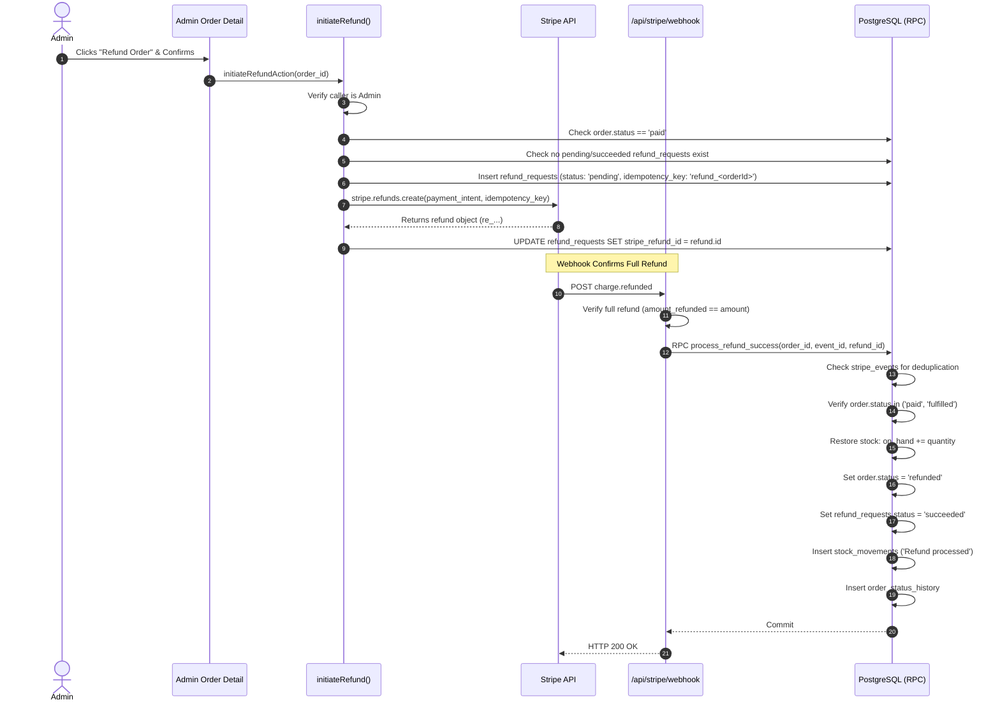
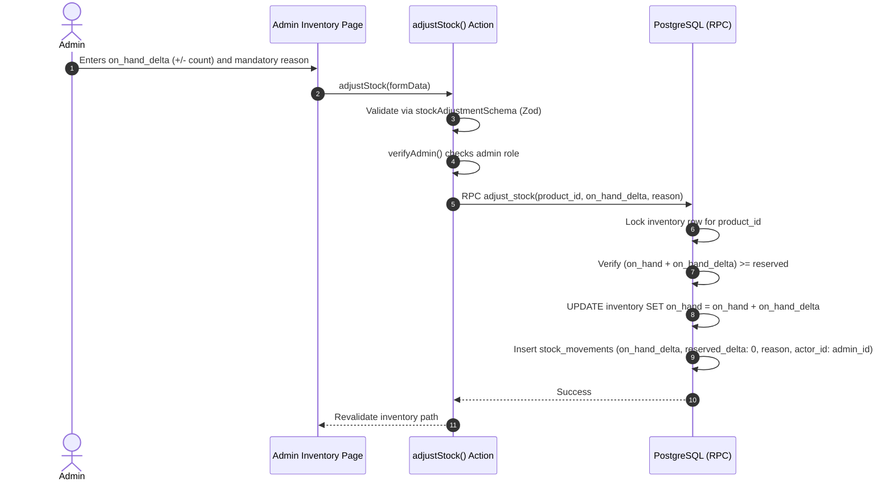

# Database Schema and System Flows Documentation

This document provides a comprehensive technical reference for the **Order Management System (OMS)**, covering the PostgreSQL database schema, data integrity rules, services layer, and end-to-end operational flows.

---

## Table of Contents
1. [Architectural Overview](#1-architectural-overview)
2. [Database Schema Reference](#2-database-schema-reference)
   - [PostgreSQL Schemas](#postgresql-schemas)
   - [Custom Enum Types](#custom-enum-types)
   - [Tables & Field Specifications](#tables--field-specifications)
   - [Database Triggers & Helper Functions](#database-triggers--helper-functions)
   - [Transactional Stored Procedures (RPCs)](#transactional-stored-procedures-rpcs)
   - [Row-Level Security (RLS) Matrix](#row-level-security-rls-matrix)
3. [Services Architecture Layer](#3-services-architecture-layer)
4. [End-to-End System Flows](#4-end-to-end-system-flows)
   - [Flow A: Two-Phase Order Creation & Checkout](#flow-a-two-phase-order-creation--checkout)
   - [Flow B: Webhook-Driven Payment Confirmation](#flow-b-webhook-driven-payment-confirmation)
   - [Flow C: Order Fulfillment](#flow-c-order-fulfillment)
   - [Flow D: Abandonment, Expiration & Cancellation](#flow-d-abandonment-expiration--cancellation)
   - [Flow E: Admin Refund & Stock Restoration](#flow-e-admin-refund--stock-restoration)
   - [Flow F: Automated Reconciliation & Self-Healing](#flow-f-automated-reconciliation--self-healing)
   - [Flow G: Manual Stock Adjustment Audit Flow](#flow-g-manual-stock-adjustment-audit-flow)

---

## 1. Architectural Overview

The system is built on **Next.js 16 (App Router)**, **Supabase (PostgreSQL 15+)**, and **Stripe (Hosted Checkout)**.

Key principles enforced by design:
- **Two-Phase Commit**: Stock is reserved in PostgreSQL before creating a Stripe session. Database locks are never held across external HTTP network calls to Stripe.
- **Deadlock Prevention**: All multi-product database locks (`SELECT ... FOR UPDATE`) are acquired strictly ordered by `product_id ASC`.
- **Database-Level Invariants**: Inventory constraints (`on_hand >= 0`, `reserved >= 0`, `reserved <= on_hand`) and the `available` calculated column are enforced directly by PostgreSQL.
- **Idempotency Everywhere**: Stripe webhook processing, checkout submissions, and refunds use deterministic keys and event deduplication tables.

---

## 2. Database Schema Reference

### PostgreSQL Schemas
- **`public`**: Application schema containing all 9 business tables, custom enums, and business logic RPCs.
- **`auth`**: Supabase system schema managing user identity (`auth.users`), sessions, and passwords.
- **`storage`**: Supabase system schema managing file buckets (e.g. `product-images`).
- **`realtime`, `extensions`, `graphql`, `pgbouncer`**: Internal Supabase engine schemas.

---

### Custom Enum Types

```sql
-- User authorization role
CREATE TYPE public.user_role AS ENUM ('customer', 'admin');

-- Order lifecycle status
CREATE TYPE public.order_status AS ENUM (
  'pending_payment',
  'paid',
  'fulfilled',
  'refunded',
  'cancelled'
);

-- Stripe integration synchronization state
CREATE TYPE public.integration_state AS ENUM (
  'awaiting_session',
  'session_created',
  'recovery_needed',
  'cancellation_pending'
);

-- Refund execution status
CREATE TYPE public.refund_status AS ENUM ('pending', 'succeeded', 'failed');
```

---

### Tables & Field Specifications

#### 1. `public.profiles`
Extends `auth.users` with application profile data and RBAC roles.
- `id` (`uuid`, PK): References `auth.users(id) ON DELETE CASCADE`.
- `role` (`public.user_role`, NOT NULL, default `'customer'`).
- `display_name` (`text`, nullable).
- `created_at` (`timestamptz`, default `now()`).
- `updated_at` (`timestamptz`, default `now()`).

#### 2. `public.products`
Catalog of sellable products.
- `id` (`uuid`, PK, default `gen_random_uuid()`).
- `sku` (`text`, UNIQUE, NOT NULL).
- `name` (`text`, NOT NULL).
- `description` (`text`, nullable).
- `price_amount` (`integer`, NOT NULL, CHECK `> 0`): Price stored in **cents** (USD).
- `image_path` (`text`, nullable): Storage URL or CDN path.
- `is_active` (`boolean`, NOT NULL, default `true`).
- `created_at` (`timestamptz`, default `now()`).
- `updated_at` (`timestamptz`, default `now()`).

#### 3. `public.inventory`
Tracks stock levels with database-level integrity constraints.
- `product_id` (`uuid`, PK): References `public.products(id) ON DELETE CASCADE`.
- `on_hand` (`integer`, NOT NULL, default `0`, CHECK `>= 0`): Physical stock in warehouse.
- `reserved` (`integer`, NOT NULL, default `0`, CHECK `>= 0`): Stock held for active checkouts.
- `available` (`integer`, GENERATED ALWAYS AS `(on_hand - reserved) STORED`): Automatically maintained sellable stock.
- `updated_at` (`timestamptz`, default `now()`).
- **Constraint**: `chk_reserved_le_on_hand` CHECK (`reserved <= on_hand`).

#### 4. `public.orders`
Order headers, payment tracking, and integration state.
- `id` (`uuid`, PK, default `gen_random_uuid()`).
- `customer_id` (`uuid`, NOT NULL): References `public.profiles(id)`.
- `email_snapshot` (`text`, NOT NULL): Customer email at the moment of order placement.
- `status` (`public.order_status`, NOT NULL, default `'pending_payment'`).
- `total_amount` (`integer`, NOT NULL, CHECK `>= 0`): Total price in cents.
- `currency` (`text`, NOT NULL, default `'usd'`).
- `checkout_request_key` (`text`, NOT NULL): Client idempotency key per checkout attempt.
- `cart_fingerprint` (`text`, NOT NULL): SHA-256 hash of sorted item IDs and quantities.
- `stripe_session_id` (`text`, UNIQUE, nullable): Stripe Checkout Session ID (`cs_...`).
- `stripe_payment_intent_id` (`text`, UNIQUE, nullable): Stripe Payment Intent ID (`pi_...`).
- `session_expires_at` (`timestamptz`, nullable): Session timeout (30 minutes from creation).
- `integration_state` (`public.integration_state`, NOT NULL, default `'awaiting_session'`).
- `created_at` (`timestamptz`, default `now()`).
- `updated_at` (`timestamptz`, default `now()`).
- **Constraint**: `uq_orders_customer_checkout_key` UNIQUE (`customer_id`, `checkout_request_key`).

#### 5. `public.order_items`
Immutable line-item snapshot of products purchased.
- `id` (`uuid`, PK, default `gen_random_uuid()`).
- `order_id` (`uuid`, NOT NULL): References `public.orders(id) ON DELETE CASCADE`.
- `product_id` (`uuid`, NOT NULL): References `public.products(id)`.
- `sku_snapshot` (`text`, NOT NULL): Product SKU at purchase time.
- `name_snapshot` (`text`, NOT NULL): Product name at purchase time.
- `unit_price_snapshot` (`integer`, NOT NULL, CHECK `> 0`): Unit price in cents.
- `quantity` (`integer`, NOT NULL, CHECK `> 0`).

#### 6. `public.stock_movements`
Append-only historical audit ledger for every inventory change.
- `id` (`uuid`, PK, default `gen_random_uuid()`).
- `product_id` (`uuid`, NOT NULL): References `public.products(id)`.
- `on_hand_delta` (`integer`, NOT NULL): Change in physical inventory (+/-).
- `reserved_delta` (`integer`, NOT NULL): Change in reserved inventory (+/-).
- `reason` (`text`, NOT NULL): Explanatory reason (e.g., `'Order reservation'`, `'Payment confirmed'`, `'Stock adjustment'`).
- `order_id` (`uuid`, nullable): References `public.orders(id)`.
- `actor_id` (`uuid`, nullable): References `auth.users(id)`.
- `created_at` (`timestamptz`, default `now()`).

#### 7. `public.order_status_history`
Timeline of state transitions for audits and customer visibility.
- `id` (`uuid`, PK, default `gen_random_uuid()`).
- `order_id` (`uuid`, NOT NULL): References `public.orders(id) ON DELETE CASCADE`.
- `previous_status` (`public.order_status`, nullable).
- `new_status` (`public.order_status`, NOT NULL).
- `description` (`text`, NOT NULL).
- `actor` (`text`, nullable).
- `is_customer_visible` (`boolean`, NOT NULL, default `true`).
- `created_at` (`timestamptz`, default `now()`).

#### 8. `public.stripe_events`
Deduplication and idempotency store for Stripe webhook events.
- `id` (`text`, PK): The Stripe Event ID (`evt_...`).
- `event_type` (`text`, NOT NULL).
- `object_id` (`text`, NOT NULL).
- `order_id` (`uuid`, nullable): References `public.orders(id)`.
- `processed_at` (`timestamptz`, nullable).
- `created_at` (`timestamptz`, default `now()`).

#### 9. `public.refund_requests`
Tracks admin-initiated refunds and prevents double-refunding.
- `id` (`uuid`, PK, default `gen_random_uuid()`).
- `order_id` (`uuid`, NOT NULL): References `public.orders(id)`.
- `idempotency_key` (`text`, UNIQUE, NOT NULL): Deterministic string (`refund_<orderId>`).
- `stripe_refund_id` (`text`, nullable): Stripe Refund ID (`re_...`).
- `status` (`public.refund_status`, NOT NULL, default `'pending'`).
- `admin_id` (`uuid`, NOT NULL): References `auth.users(id)`.
- `created_at` (`timestamptz`, default `now()`).
- `updated_at` (`timestamptz`, default `now()`).
- **Constraint**: Partial UNIQUE index `idx_refund_requests_single_active_or_succeeded` on `(order_id)` WHERE `status IN ('pending', 'succeeded')`.

---

### Database Triggers & Helper Functions

1. **`handle_updated_at()`**: Automatically updates `updated_at = now()` on record modifications across `profiles`, `products`, `inventory`, `orders`, and `refund_requests`.
2. **`handle_new_user()`**: Fires `AFTER INSERT ON auth.users`. Creates a default `profiles` row with `role = 'customer'` and metadata display name.
3. **`is_admin()`**: Security definer helper returning boolean check:
   ```sql
   SELECT EXISTS (SELECT 1 FROM public.profiles WHERE id = auth.uid() AND role = 'admin');
   ```

---

### Transactional Stored Procedures (RPCs)

All critical mutations execute inside atomic PostgreSQL stored procedures defined in `supabase/migrations/002_functions.sql`:

- **`create_order_with_reservation(...)`**:
  1. Validates checkout idempotency key and cart fingerprint.
  2. Aggregates requested quantities into temporary table.
  3. Acquires row locks on `products` and `inventory` using `ORDER BY product_id ASC`.
  4. Verifies `(on_hand - reserved) >= requested_quantity`.
  5. Inserts `orders` with `status = 'pending_payment'`, `integration_state = 'awaiting_session'`.
  6. Inserts `order_items` snapshots.
  7. Updates `inventory.reserved = reserved + quantity`.
  8. Appends audit log to `stock_movements`.
- **`process_payment_success(...)`**:
  1. Records event in `stripe_events` (deduplication check).
  2. Validates order status is `pending_payment`.
  3. Transitions order status to `paid`.
  4. Atomically adjusts inventory: `on_hand = on_hand - quantity`, `reserved = reserved - quantity`.
  5. Inserts audit entries into `stock_movements` and `order_status_history`.
- **`process_cancellation(...)`**:
  1. Validates order status is `pending_payment`.
  2. Transitions order to `cancelled`.
  3. Releases reserved stock: `reserved = reserved - quantity`.
  4. Appends audit records.
- **`process_refund_success(...)`**:
  1. Restores physical inventory: `on_hand = on_hand + quantity`.
  2. Transitions order status to `refunded`.
  3. Updates `refund_requests.status = 'succeeded'`.
  4. Appends audit records.
- **`fulfill_order(p_order_id)`**:
  - Admin-only RPC; validates order is `paid`, transitions status to `fulfilled`.
- **`adjust_stock(p_product_id, p_on_hand_delta, p_reason)`**:
  - Admin-only RPC; modifies physical `on_hand` with mandatory audit reason.
- **`get_product_catalog()`**:
  - Public RPC returning active products and calculated availability without exposing internal reserve numbers.

---

### Row-Level Security (RLS) Matrix

| Table | Anonymous (`anon`) | Customer (`authenticated`) | Admin (`authenticated`) | Service Role (`backend/webhook`) |
|---|---|---|---|---|
| `products` | SELECT (if `is_active = true`) | SELECT (if `is_active = true`) | ALL (SELECT, INSERT, UPDATE, DELETE) | FULL BYPASS |
| `profiles` | None | SELECT / UPDATE (own record `id = auth.uid()`) | ALL | FULL BYPASS |
| `inventory` | None | None | SELECT only (Mutations via RPC) | FULL BYPASS |
| `orders` | None | SELECT (own `customer_id = auth.uid()`) | ALL | FULL BYPASS |
| `order_items` | None | SELECT (via `EXISTS` join on owned orders) | ALL | FULL BYPASS |
| `stock_movements` | None | None | SELECT only (Mutations via RPC) | FULL BYPASS |
| `order_status_history` | None | SELECT (owned order + `is_customer_visible = true`) | ALL | FULL BYPASS |
| `stripe_events` | None | None | None | FULL BYPASS |
| `refund_requests` | None | None | ALL | FULL BYPASS |

---

## 3. Services Architecture Layer

The application code in `src/` orchestrates workflows between the browser, Supabase, and Stripe:

```
src/
├── app/
│   ├── (auth)/                     # Signup, Login, Password Reset
│   ├── (store)/                    # Storefront catalog, Cart, Checkout, Return page
│   ├── account/                    # Customer order history & order details
│   ├── admin/                      # Admin dashboard, products, stock, orders
│   │   └── actions.ts              # Admin server actions (create, update, adjust, fulfill, refund)
│   └── api/
│       ├── internal/reconcile/     # Background reconciliation & self-healing cron
│       └── stripe/webhook/         # Webhook handler (checkout, payment, refund, expiry)
├── lib/
│   ├── auth/actions.ts             # Auth server actions (signIn, signUp, signOut)
│   ├── services/
│   │   ├── checkout.ts             # Two-Phase checkout & Stripe session creation
│   │   ├── actions.ts              # Server action wrapper for checkout
│   │   ├── refund.ts               # Stripe refund initiation & idempotency
│   │   └── payment-failure.ts      # Expiration & cancellation coordinator
│   ├── stripe/                     # Stripe client singleton & helpers
│   ├── supabase/                   # Supabase clients (client, server, admin service-role)
│   └── validation/schemas.ts       # Zod validation schemas
└── middleware.ts                   # Route guards for /admin and /account
```

---

## 4. End-to-End System Flows

### Flow A: Two-Phase Order Creation & Checkout



---

### Flow B: Webhook-Driven Payment Confirmation



---

### Flow C: Order Fulfillment



---

### Flow D: Abandonment, Expiration & Cancellation



---

### Flow E: Admin Refund & Stock Restoration



---

### Flow F: Automated Reconciliation & Self-Healing

The endpoint `/api/internal/reconcile` runs as a periodic cron job to automatically detect and heal stranded states:

1. **Uncertain Sessions (`awaiting_session` or `recovery_needed`)**:
   - Finds pending orders created $> 5$ minutes ago that failed during Stripe session creation.
   - Queries Stripe API: if expired or missing, calls `process_cancellation` to release reserved stock.
2. **Overdue Pending Orders**:
   - Finds orders with `session_expires_at < NOW() - 5 minutes` still in `pending_payment`.
   - Verifies with Stripe API that payment was not made, then calls `process_cancellation`.
3. **Dangling Refund Requests**:
   - Finds `refund_requests` stuck in `pending` for $> 10$ minutes.
   - Resolves status against Stripe API and syncs DB state.

---

### Flow G: Manual Stock Adjustment Audit Flow


