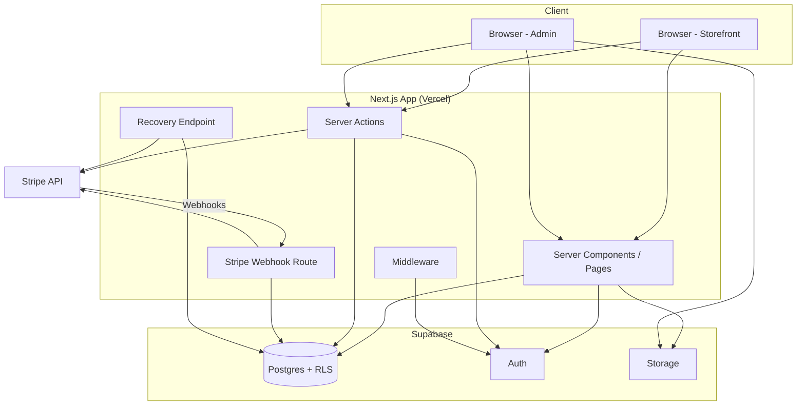
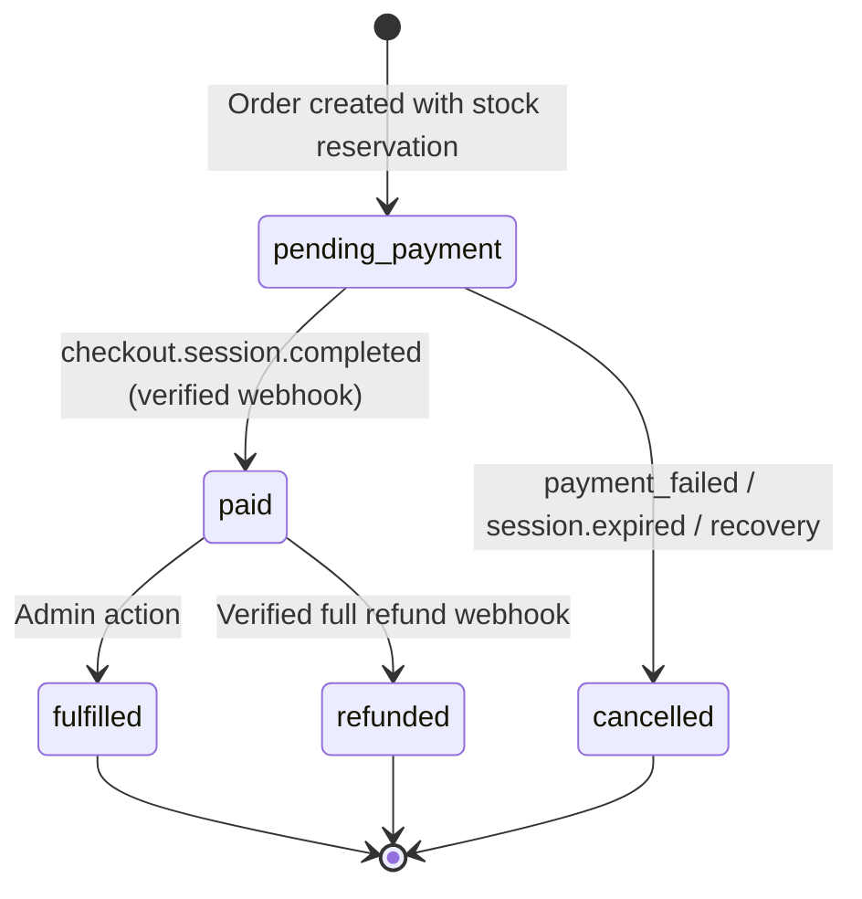

# Order Management System — Implementation Plan

## Overview

Build a full-stack order management system using **Next.js 14+ (App Router, TypeScript)**, **Supabase** (Postgres + Auth + Storage + RLS), **Stripe** (test-mode, hosted Checkout), deployed on **Vercel**. The system supports public storefront browsing, authenticated checkout with atomic stock reservation, webhook-driven payment confirmation, admin product/order management, and full refund flows.

> [!IMPORTANT]
> This plan targets the assessment brief's **12–20 hour** estimate. Correctness (inventory atomicity, payment safety, authorization) takes priority over visual polish.

---

## User Review Required

> [!WARNING]
> **Supabase & Stripe credentials**: You'll need to provide Supabase project URL/keys and Stripe test-mode keys before the checkout/webhook stages can be tested. An `.env.example` will be provided.

> [!IMPORTANT]
> **Admin seeding**: The first admin user must be seeded via a SQL script or a protected bootstrap endpoint. The plan uses a SQL seed approach — confirm this is acceptable.

---

## Open Questions

1. **Deployment target**: Should we set up Vercel deployment as part of this plan, or defer to manual deployment later?
2. **Image storage**: Should we use Supabase Storage for product images or simple URL references to start?
3. **Styling framework**: Tailwind CSS is assumed — any preference for a component library (shadcn/ui, Radix, plain Tailwind)?
4. **Testing scope**: The spec lists many integration tests. Should we implement all verification scenarios or focus on the critical-path ones first?

---

## Proposed Changes

### Phase 1: Foundation & Auth (~2 hours)

#### [NEW] Project scaffolding

- `npx create-next-app@latest` with App Router, TypeScript, Tailwind CSS, ESLint
- Install dependencies: `@supabase/supabase-js`, `@supabase/ssr`, `stripe`, `zod`
- Configure `.env.local` / `.env.example` with Supabase and Stripe keys
- Set up `next.config.ts`

#### [NEW] [supabase/](file:///d:/Projects/Order%20Management%20System/supabase/) — Supabase project config

- `supabase/config.toml` for local dev
- Initial migration structure

#### [NEW] [src/lib/supabase/](file:///d:/Projects/Order%20Management%20System/src/lib/supabase/) — Supabase clients

- `client.ts` — Browser client (anon key)
- `server.ts` — Server client (cookie-based auth for SSR/Server Actions)
- `admin.ts` — Service-role client (server-only, for webhooks/recovery)
- `types.ts` — Generated database types

#### [NEW] [src/lib/stripe/](file:///d:/Projects/Order%20Management%20System/src/lib/stripe/) — Stripe client

- `client.ts` — Server-only Stripe SDK initialization
- `config.ts` — Currency, webhook secret, checkout config

#### [NEW] [src/app/(auth)/](file:///d:/Projects/Order%20Management%20System/src/app/(auth)/) — Auth pages

- `login/page.tsx` — Email/password sign-in
- `signup/page.tsx` — Registration (defaults to `customer` role)
- `reset-password/page.tsx` — Password reset flow
- `callback/route.ts` — Auth callback handler

#### [NEW] [src/middleware.ts](file:///d:/Projects/Order%20Management%20System/src/middleware.ts) — Route protection

- Supplementary middleware for auth state refresh
- Redirect unauthenticated users from protected routes

---

### Phase 2: Database Schema, RLS, & Stock Transactions (~4 hours)

#### [NEW] [supabase/migrations/001_schema.sql](file:///d:/Projects/Order%20Management%20System/supabase/migrations/001_schema.sql)

**Tables** (with constraints, indexes, FKs):

| Table | Key Columns | Notes |
|---|---|---|
| `profiles` | `id (FK auth.users)`, `role`, `display_name`, timestamps | Default role = `customer`; trigger on `auth.users` insert |
| `products` | `id`, `sku (UNIQUE)`, `name`, `description`, `price_amount` (integer cents), `image_path`, `is_active`, timestamps | `price_amount > 0` constraint |
| `inventory` | `product_id (FK, UNIQUE)`, `on_hand`, `reserved`, `available GENERATED ALWAYS AS (on_hand - reserved) STORED`, `updated_at` | `CHECK (on_hand >= 0)`, `CHECK (reserved >= 0)`, `CHECK (reserved <= on_hand)` |
| `orders` | `id`, `customer_id`, `email_snapshot`, `status`, `total_amount`, `currency`, `checkout_request_key`, `cart_fingerprint`, `stripe_session_id`, `stripe_payment_intent_id`, `session_expires_at`, `integration_state`, timestamps | `UNIQUE (customer_id, checkout_request_key)`, `UNIQUE (stripe_session_id)` where not null |
| `order_items` | `id`, `order_id`, `product_id`, `sku_snapshot`, `name_snapshot`, `unit_price_snapshot`, `quantity` | `quantity > 0`, immutable snapshots |
| `stock_movements` | `id`, `product_id`, `on_hand_delta`, `reserved_delta`, `reason`, `order_id`, `actor_id`, `created_at` | Append-only audit trail |
| `order_status_history` | `id`, `order_id`, `previous_status`, `new_status`, `description`, `actor`, `created_at` | Customer-safe + internal diagnostics |
| `stripe_events` | `id (Stripe event ID, PK)`, `event_type`, `object_id`, `order_id`, `processed_at` | Idempotency tracking |
| `refund_requests` | `id`, `order_id`, `idempotency_key`, `stripe_refund_id`, `status`, `admin_id`, timestamps | Prevent overlapping active/successful refunds |

**Enums**:
- `order_status`: `pending_payment`, `paid`, `fulfilled`, `refunded`, `cancelled`
- `integration_state`: `awaiting_session`, `session_created`, `recovery_needed`, `cancellation_pending`
- `user_role`: `customer`, `admin`

**RLS Policies** (all tables):

| Table | Anonymous | Customer | Admin |
|---|---|---|---|
| `products` (active) | SELECT | SELECT | ALL |
| `profiles` | — | SELECT/UPDATE own | ALL |
| `orders` | — | SELECT own | ALL (controlled mutations) |
| `order_items` | — | SELECT (via order ownership) | ALL |
| `order_status_history` | — | SELECT own (customer-safe) | ALL |
| `inventory` | — | — (exposed via function) | SELECT, UPDATE via functions |
| `stock_movements` | — | — | SELECT |
| `stripe_events` | — | — | Server-only (service role) |
| `refund_requests` | — | — | SELECT, INSERT via functions |

#### [NEW] [supabase/migrations/002_functions.sql](file:///d:/Projects/Order%20Management%20System/supabase/migrations/002_functions.sql)

**Database functions** (SECURITY DEFINER with fixed search_path):

1. **`create_order_with_reservation()`** — Atomic order creation:
   - Validate inputs (quantities, bounds, cart size)
   - Combine duplicate products
   - Handle idempotent checkout_request_key:
     - If key exists with a non-cancelled, non-terminal order → return existing order (idempotent)
     - If key exists but cart fingerprint differs → reject with error
     - **If key exists on a cancelled order → reject and require a fresh key** (per Rule 8: retries after cancellation start a new order with new availability check)
   - Lock product/inventory rows in consistent order (`ORDER BY product_id`)
   - Read authoritative prices, verify active status
   - Check availability (`on_hand - reserved >= requested`)
   - Insert order + order_items snapshots
   - Increment reservations
   - Write stock_movements + initial status_history
   - All-or-nothing rollback on any failure

2. **`process_payment_success()`** — Webhook handler for paid transition:
   - Lock order, validate `pending_payment` status
   - Transition to `paid`
   - Decrement `on_hand` and `reserved` by purchased quantities
   - Write stock_movements + status_history
   - Mark stripe_event processed

3. **`process_cancellation()`** — Cancel order & release stock:
   - Lock order, validate `pending_payment` status
   - Transition to `cancelled`
   - Release reservations (decrement `reserved`)
   - Write stock_movements + status_history

4. **`process_refund_success()`** — Refund stock restoration:
   - Lock order, validate `paid` status + matching refund request
   - Transition to `refunded`
   - Restore `on_hand` by refunded quantities
   - Write stock_movements + status_history

5. **`adjust_stock()`** — Admin stock adjustment:
   - Require admin role
   - Require reason
   - Validate `on_hand` won't go below `reserved`
   - Write stock_movement

6. **`fulfill_order()`** — Admin fulfillment:
   - Lock order, validate `paid` status
   - Reject if active refund request exists
   - Transition to `fulfilled`
   - Write status_history

7. **`get_product_catalog()`** — Public catalog view:
   - Return active products with `available` from the generated stored column (no direct inventory table access for shoppers)

#### [NEW] [supabase/seed.sql](file:///d:/Projects/Order%20Management%20System/supabase/seed.sql)

- Sample products with images, prices, inventory
- Admin user seed instructions

---

### Phase 3: Checkout, Webhooks, Cancellation, Refunds (~5 hours)

#### [NEW] [src/lib/services/checkout.ts](file:///d:/Projects/Order%20Management%20System/src/lib/services/checkout.ts) — Checkout service

**Order Creation Flow**:
1. Accept cart items + checkout_request_key from client
2. Call `create_order_with_reservation()` DB function
3. On success → create Stripe Checkout Session:
   - Build line items from saved order snapshots (not client data)
   - Card-only payments, 30-minute expiry
   - Include `order_id` in metadata
   - Stable idempotency key derived from checkout_request_key
4. Save `stripe_session_id`, `stripe_payment_intent_id`, `session_expires_at`
5. Return checkout URL

**Gap Handling**:
- DB success + Stripe definite failure → cancel order, release stock
- DB success + Stripe timeout → mark `recovery_needed`, retain reservation
- Stripe success + DB save failure → recover via metadata lookup

#### [NEW] [src/app/api/stripe/webhook/route.ts](file:///d:/Projects/Order%20Management%20System/src/app/api/stripe/webhook/route.ts) — Stripe webhook

**Signature verification** using raw body (disable body parsing for this route). **Specify `export const runtime = 'nodejs'`** to avoid Edge runtime compatibility issues.

**Events handled**:

| Event | Action |
|---|---|
| `checkout.session.completed` | Verify payment_status === 'paid', call `process_payment_success()` |
| `payment_intent.payment_failed` | Initiate safe cancellation flow (expire session first, then cancel order) |
| `checkout.session.expired` | Release reservation via `process_cancellation()` |
| `charge.refunded` | Verify full refund, call `process_refund_success()` |

**Order resolution**: Always resolve the order using `order_id` from Stripe Session/PaymentIntent **metadata** (not by looking up `stripe_session_id` in the DB), to handle the gap where the session ID may not yet be saved to the database.

**Per event**: Deduplicate via `stripe_events`, lock order, validate state, apply transition atomically.

#### [NEW] [src/lib/services/payment-failure.ts](file:///d:/Projects/Order%20Management%20System/src/lib/services/payment-failure.ts)

Payment failure cancellation sequence:
1. Verify event, identify order
2. Check if cancellation applicable
3. Record durable cancellation request
4. **Outside DB transaction**: Expire the Checkout Session via Stripe API
5. Confirm session expired and unpaid
6. **In DB transaction**: Lock order → cancel if still pending → release stock → write history → complete event
7. If expiration fails because session completed: let success webhook handle it
8. If timeout: retain reservation, retry later

#### [NEW] [src/lib/services/refund.ts](file:///d:/Projects/Order%20Management%20System/src/lib/services/refund.ts)

Admin refund initiation:
1. Verify admin role
2. Lock order → require `paid` status, no active/successful refund
3. Persist refund_request with idempotency key
4. Commit
5. Call `stripe.refunds.create()` with idempotency key
6. Persist/recover result

#### [NEW] [src/app/api/internal/reconcile/route.ts](file:///d:/Projects/Order%20Management%20System/src/app/api/internal/reconcile/route.ts) — Recovery endpoint

Protected endpoint (API key or admin auth). **Specify `export const runtime = 'nodejs'`.**

Recovery operations (bounded, repeatable):
- **Uncertain session creation**: Orders in `awaiting_session` / `recovery_needed` state — query Stripe by idempotency key or metadata, save session ref or cancel
- **Missing session references**: Orders with DB order but no `stripe_session_id` — search Stripe sessions by metadata `order_id`
- **Failed cancellation/expiration calls**: Orders in `cancellation_pending` — retry Stripe session expiration
- **Overdue pending sessions**: Orders past `session_expires_at` — verify Stripe state before releasing (local age alone is insufficient)
- **Dangling refund requests**: `refund_requests` in `pending` status — query `stripe.refunds.list()` by idempotency key to resolve outcome, then update status or allow retry
- **Missing webhook processing**: Fetch recent Stripe events and replay against DB to recover any missed webhook deliveries

> [!IMPORTANT]
> Recovery must NOT independently mark orders as paid. It preserves the verified-webhook boundary. For missing webhook recovery, the endpoint fetches events from Stripe and replays them through the same webhook processing logic.

Manual invocation documented in README:
```bash
# Run recovery manually
curl -X POST https://your-app.vercel.app/api/internal/reconcile \
  -H "Authorization: Bearer $RECOVERY_API_KEY"
```

---

### Phase 4: Storefront & Customer Pages (~2 hours)

#### [NEW] [src/app/(store)/page.tsx](file:///d:/Projects/Order%20Management%20System/src/app/(store)/page.tsx) — Product listing

- Server-rendered product grid
- Shows images, prices (formatted from cents), availability
- Disabled purchase controls when out of stock

#### [NEW] [src/app/(store)/products/[id]/page.tsx](file:///d:/Projects/Order%20Management%20System/src/app/(store)/products/[id]/page.tsx) — Product detail

- Full product info, image, price, stock status
- Add to cart with quantity selector

#### [NEW] [src/components/cart/](file:///d:/Projects/Order%20Management%20System/src/components/cart/) — Cart components

- `CartProvider.tsx` — React context with client-state cart (localStorage optional bonus)
- `CartDrawer.tsx` — Slide-out cart with quantity editing, item removal
- `CartSummary.tsx` — Totals and checkout button

#### [NEW] [src/app/(store)/checkout/page.tsx](file:///d:/Projects/Order%20Management%20System/src/app/(store)/checkout/page.tsx) — Checkout page

- Requires authentication (redirect to login if needed)
- Cart review, proceed to Stripe Checkout
- Meaningful error messages for stock conflicts, validation failures

#### [NEW] [src/app/(store)/checkout/return/page.tsx](file:///d:/Projects/Order%20Management%20System/src/app/(store)/checkout/return/page.tsx) — Checkout return

- Reads order state (polling or server component)
- Shows "Payment processing" while awaiting webhook confirmation
- Never changes payment status from the redirect

#### [NEW] [src/app/account/orders/page.tsx](file:///d:/Projects/Order%20Management%20System/src/app/account/orders/page.tsx) — Customer order list

- Paginated order history
- Status badges, dates, totals

#### [NEW] [src/app/account/orders/[id]/page.tsx](file:///d:/Projects/Order%20Management%20System/src/app/account/orders/[id]/page.tsx) — Customer order detail

- Items, total, status, customer-safe timeline
- **Refund pending indicator**: When order is `paid` but has an active `refund_request`, display "Refund processing" alongside the status badge (per Section 10: retain `paid` status but show separate processing info)

---

### Phase 5: Admin Screens (~3 hours)

#### [NEW] [src/app/admin/layout.tsx](file:///d:/Projects/Order%20Management%20System/src/app/admin/layout.tsx) — Admin layout

- Admin role verification (server-side, not just middleware)
- Admin navigation sidebar

#### [NEW] [src/app/admin/products/](file:///d:/Projects/Order%20Management%20System/src/app/admin/products/) — Product management

- `page.tsx` — Product list with active/inactive filter
- `new/page.tsx` — Create product form (name, SKU, description, price, image upload)
- `[id]/edit/page.tsx` — Edit product, deactivate toggle
- Image upload with size/type restrictions (Supabase Storage)

#### [NEW] [src/app/admin/products/[id]/inventory/page.tsx](file:///d:/Projects/Order%20Management%20System/src/app/admin/products/[id]/inventory/page.tsx) — Stock management

- Current on_hand, reserved, available display
- Stock adjustment form with mandatory reason field
- Stock movement history

#### [NEW] [src/app/admin/orders/](file:///d:/Projects/Order%20Management%20System/src/app/admin/orders/) — Order management

- `page.tsx` — Paginated order list, status filtering, search by order ID or email
- `[id]/page.tsx` — Order details, payment references, full status timeline
  - **Refund pending banner**: When a `refund_request` is active/pending, show processing status and disable both fulfillment and refund buttons
- Fulfillment button (validates `paid` status, no active refund)
- Refund button (validates `paid` status, not fulfilled)

---

### Phase 6: Verification, Deployment, Documentation (~4 hours)

#### [NEW] [tests/](file:///d:/Projects/Order%20Management%20System/tests/) — Integration tests

Critical invariant tests:
- [ ] Two concurrent buyers for last unit → only one succeeds
- [ ] Multi-item stock conflict → complete rollback
- [ ] Duplicate checkout request → no duplicate reservation/session
- [ ] Invalid quantities / manipulated prices → rejected
- [ ] Declined card → order cancelled, stock restored
- [ ] Fresh checkout after cancellation → new availability check
- [ ] Session expiry → exactly one stock release
- [ ] Duplicate/overlapping webhooks → no repeated effects
- [ ] Delayed failure after success → no cancellation
- [ ] Invalid webhook signature → no mutation
- [ ] Customer cannot access other orders or admin functions
- [ ] Customer cannot self-promote to admin
- [ ] Concurrent refund/fulfillment → one valid outcome
- [ ] Duplicate refunds → no repeated restock
- [ ] Product edits preserve order snapshots
- [ ] Migrations recreate full schema

#### [NEW] [README.md](file:///d:/Projects/Order%20Management%20System/README.md)

- Local setup instructions
- Environment variables reference
- Stripe CLI webhook forwarding
- Admin seeding
- Test credentials
- **Recovery operations**: How to trigger manual reconciliation via the recovery endpoint, including webhook replay for missed events
- **Deployment notes**: Vercel cron/manual recovery setup, auth redirect configuration

#### [NEW] [DECISIONS.md](file:///d:/Projects/Order%20Management%20System/DECISIONS.md)

Technical write-up (500–1000 words):
1. Stock reservation & concurrency approach
2. Webhook idempotency design
3. RLS policy design + one tricky policy explained
4. Failure cancellation & stale-event handling
5. What would change with another week
6. What was cut for time

#### [NEW] [.env.example](file:///d:/Projects/Order%20Management%20System/.env.example)

```
NEXT_PUBLIC_SUPABASE_URL=
NEXT_PUBLIC_SUPABASE_ANON_KEY=
SUPABASE_SERVICE_ROLE_KEY=
STRIPE_SECRET_KEY=
STRIPE_WEBHOOK_SECRET=
RECOVERY_API_KEY=
```

> [!NOTE]
> `NEXT_PUBLIC_STRIPE_PUBLISHABLE_KEY` is intentionally omitted — hosted Stripe Checkout uses server-side session creation and redirect, so no client-side Stripe SDK is needed.

---

## Architecture Diagram



## Order State Machine



## Locking Order Convention

To prevent deadlocks across all operations:
1. Always lock inventory rows in ascending `product_id` order
2. Always lock the order row before modifying related records
3. Never hold DB locks while calling Stripe APIs

---

## Verification Plan

### Automated Tests
```bash
# Type checking
npx tsc --noEmit

# Linting
npx next lint

# Production build
npm run build

# Integration tests (requires Supabase local + Stripe test keys)
npm test
```

### Manual Verification
- Test with Stripe test cards: `4242 4242 4242 4242` (success), `4000 0000 0000 0002` (decline)
- Replay webhook via Stripe CLI: `stripe trigger checkout.session.completed`
- Verify RLS by attempting cross-customer data access
- Test concurrent checkout scenarios

### Stripe CLI Webhook Testing
```bash
stripe listen --forward-to localhost:3000/api/stripe/webhook
```

---

## Implementation Strategy (Cross-Review)

Per the cross-review skill, each phase will be:
1. **Implemented by a flash-tier subagent** (lower-level model for coding)
2. **Cross-reviewed by a pro/inherit-tier subagent** (higher-level model for review)
3. Iterated until the reviewer approves (max 3 iterations per phase)

This ensures code quality through cross-family model review while keeping implementation efficient.
